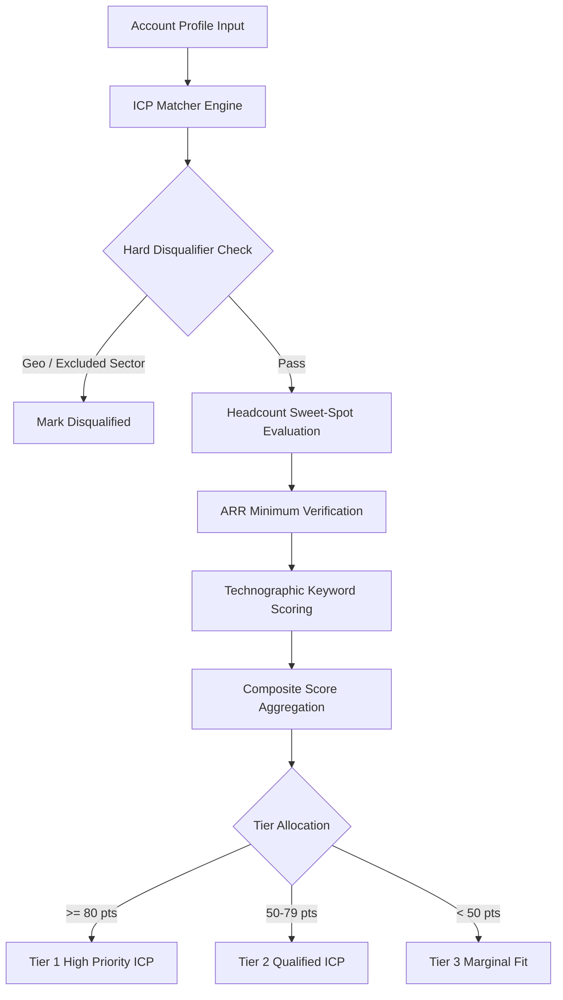

# GenPark AI Agent Skill - ICP Firmographic Matcher & Filter

Evaluates enterprise and mid-market accounts against strict multi-dimensional Ideal Customer Profile (ICP) rules to automate qualification grading.

Verified by [GenPark AI](https://genpark.ai) and compatible with [Model Context Protocol (MCP)](https://genpark.ai/mcp).

## Architecture Diagram

## Features
- **Hard Disqualification Rails**: Immediately filters out illegal jurisdictions or off-target industries.
- **Weighted Fit Scoring**: Rewards accounts falling squarely in target ARR and team size bands.
- **Technographic Match Bonus**: Identifies existing stack compatibility.
- **Zero External Dependencies**: Python standard library only.
